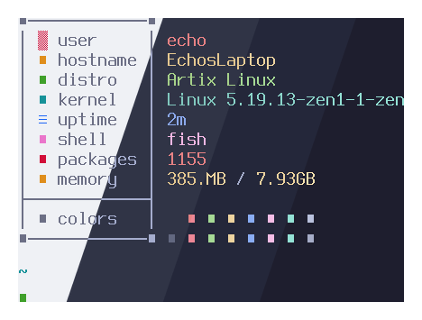
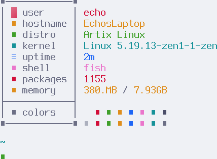
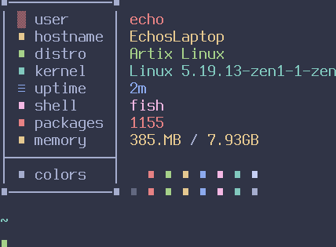

<h3 align="center">
	 
	
	Catppuccin for TTY
</h3>

	
	
	

  

## Previews

🌻 Latte

🪴 Frappé

🌺 Macchiato

🌿 Mocha

## Usage

1. Copy the contents of your preferred flavor from [`themes/`](./themes/) and add it to your kernel options
2. Restart your computer

### GRUB

1. Edit `/etc/default/grub` and append the theme kernel options to `GRUB_CMDLINE_LINUX` (eg. `GRUB_CMDLINE_LINUX="vt.default_red..."`)
2. Run `sudo grub-mkconfig -o /boot/grub/grub.cfg`

### systemd-boot

1. Edit the boot entry located in `/boot/loader/entries/`
2. Append the theme kernel options to the `options` line
3. Run `sudo bootctl update`

### Limine

1. Edit `/boot/limine.cfg`
2. Append the theme kernel options to the boot entry's `CMDLINE`

### Other

For other bootloaders or for more information, [see here on ArchWiki](https://wiki.archlinux.org/title/Kernel_parameters)

## 💝 Thanks to

- [Echo](https://github.com/CallMeEchoCodes)
- [mekb](https://github.com/mekb-turtle)

&nbsp;

	

	Copyright &copy; 2021-present <a href="https://github.com/catppuccin" target="_blank">Catppuccin Org</a>

	

